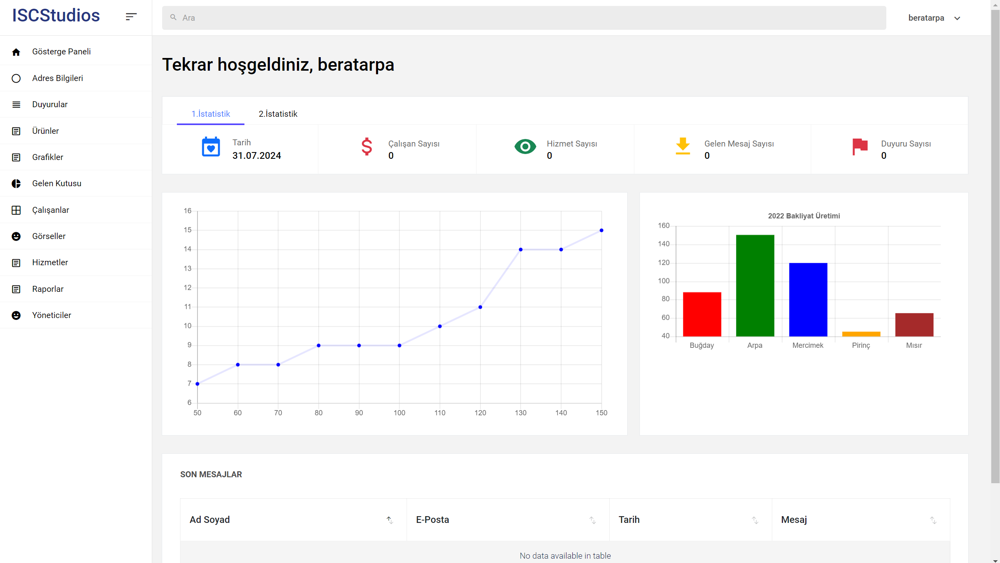

# N-Tier-ASP.NET-Agriculture

## About

This project is a web application centered around agriculture, developed using a multi-layered architecture. The application provides various functionalities related to agriculture management, including charts, dashboards, employee management, and more.

## Screenshot


## Features

- **Dashboard**: Provides an overview of key metrics and insights.
- **Employee Management**: Manage employee records and profiles.
- **Product Management**: Handle agricultural products and inventory.
- **Charts**: Visualize data using various chart types.
- **Reports**: Generate and view reports related to agricultural activities.
- **Login**: Secure authentication for users.
- **Profile Management**: Manage user profiles and settings.
- **Contact**: Contact information and communication features.
- **Announcements**: Display important announcements related to agriculture.

## Technologies Used

- **ASP.NET Core**: Framework for building the web application.
- **C#**: Programming language used for application logic.
- **Entity Framework**: ORM for database interactions.
- **SQL Server**: Database management system.
- **MVC Architecture**: Implements the Model-View-Controller pattern.
- **JavaScript/CSS**: For front-end development and styling.

## Installation

1. **Clone the Repository**:
    ```sh
    git clone https://github.com/BeratARPA/N-Tier-ASP.NET-Agriculture.git
    ```
2. **Open with Visual Studio**: Open the project in Visual Studio.
3. **Install Dependencies**: Restore NuGet packages.
4. **Configure Database**: Set up the SQL Server database and connection strings in `appsettings.json`.
5. **Run the Project**: Press F5 or use the run command to start the application.

## Usage

1. **Login**: Use the login interface to access the application.
2. **Navigate Dashboard**: View key metrics and insights on the dashboard.
3. **Manage Employees**: Add and manage employee records.
4. **Manage Products**: Handle agricultural products and inventory.
5. **Generate Reports**: Access and generate various reports.
6. **Contact and Announcements**: View contact information and announcements.

## Contributing

If you would like to contribute, please fork the repository, create a feature branch, and submit a pull request.

## License

This project is licensed under the MIT License. See the [LICENSE](LICENSE) file for more details.

## Contact

For questions or feedback, feel free to contact me:
- **Email**: [beratarpa@hotmail.com](mailto:beratarpa@hotmail.com)
- **GitHub**: [https://github.com/BeratARPA/N-Tier-ASP.NET-Agriculture](https://github.com/BeratARPA/N-Tier-ASP.NET-Agriculture)
